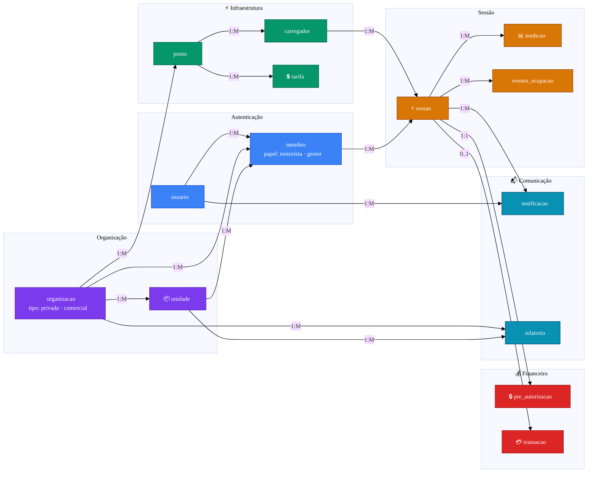

# ⚡ EV ChargeOps

**Enterprise Challenge 2026 — FIAP × GoodWe**

Plataforma para gestão de recarga de veículos elétricos em infraestrutura compartilhada: sessões por usuário, rateio justo por kWh e inteligência operacional.

### 🌐 Site de apresentação

> **[👉 Acesse a apresentação interativa do EV ChargeOps](https://site-pink-xi-65.vercel.app/)**
>
> Conheça o produto, as 5 fases de construção, o modelo de negócio e a jornada de recarga em um site dedicado.

---

## 👥 Equipe

| Integrante | RM |
|---|---|
| Julia Ramos | RM568988 |
| Matheus Fuchelberguer | RM571321 |
| Carlos Eugenio Andrade | RM570285 |
| Rodrigo Gomes Dias | RM569142 |

**Repositório:** https://github.com/rodrigogmdias/ev-chargeops

---

## 🎯 1. Problema e contexto

A GoodWe, em parceria com a FIAP (Energy Innovation Lab — Aclimação), opera um carregador **HCA G2** no estacionamento L1. O desafio é transformar sessões de recarga em infraestrutura compartilhada — condomínios, empresas e campus — em **dados estruturados, rateio justo e inteligência acionável**.

Hoje falta, na prática:

- 🔍 Identificar quem carregou e quanto consumiu (kWh)
- 💰 Cobrar de forma transparente
- 📊 Dar visibilidade ao gestor e ao motorista
- ⚡ Gerenciar a capacidade elétrica do local

**Cenário adotado:** condomínio residencial com carregador compartilhado, extensível a edifícios corporativos e campus.

**Pergunta norteadora:** como estruturar sessões, calcular consumo individual e aplicar rateio justo com experiência digital clara?

---

## 🔬 2. Frente 1 — Contexto e problema

### O que é recarga compartilhada

Um ou poucos carregadores atendem vários usuários em área comum. O desafio não é só energia — é **atribuir sessões, medir kWh e cobrar com justiça**.

Principais dificuldades: ausência de controle por usuário, cobrança opaca, conflito de vaga/horário, falta de relatório para o gestor e sessões interrompidas sem registro parcial.

### 🏢 Ambientes de recarga compartilhada

O produto endereça **dois modelos de operação** com perfis jurídicos e operacionais distintos. O cenário-foco é condomínio residencial, mas a arquitetura serve todos:

| Modelo | Ambientes | Característica |
|---|---|---|
| **Rede privada** | Condomínio residencial · Condomínio comercial / lajes · Edifício corporativo · Campus universitário · Hospital / associação | Organização **só repassa o custo do kWh** (sem margem na energia) |
| **Rede comercial** | Estacionamento de destino (shopping, aeroporto) · Posto / eletroposto · Hotel / resort / coworking | Organização define preço livremente, com margem e precificação dinâmica |

### Sessão de recarga (visão técnica)

Entre conectar o veículo e desconectar, o carregador passa por estados (padrão IEC 61851) e gera dados: início/fim, potência (W), energia acumulada (kWh), duração. No HCA G2, esses dados são obtidos pela **API SEMS Portal** (GoodWe).

### 💰 Modelos de cobrança

A cobrança é feita **por kWh consumido** — modelo central do EV ChargeOps, em duas variantes: **rateio de custo** (rede privada, sem margem) e **por sessão** (rede comercial, com margem e tarifa dinâmica).

A diferença entre os dois modelos não está na tecnologia (API SEMS, medição e autenticação são iguais) mas nas **regras de precificação e natureza fiscal**:

| Dimensão | Rede privada | Rede comercial |
|---|---|---|
| Markup sobre o kWh | **Proibido** — custo real (ANEEL RN 1.000/2021, art. 2º, XV) | Permitido — preço livre |
| Precificação dinâmica por demanda | Não aplicável à energia | Disponível |
| Pagamento | Cartão pré-pago (Stripe) ou boleto pós-pago — configurável | Cartão pré-pago (Stripe) |
| Documento fiscal | Rateio de despesa (não NFS-e) | NFS-e obrigatória |
| Como o EV ChargeOps é remunerado | **Assinatura SaaS por organização** | Assinatura + % da transação |

### 📋 Opção B — Pesquisa com usuários

Formulário aplicado a **10 motoristas de EV/híbridos plug-in** (26/05–09/06/2026, pesquisa própria da equipe).

**Principais resultados:**

- **9/10** citaram fila, vaga ocupada ou conflito de horário como maior problema
- **10/10** preferem cobrança por **kWh**
- Features mais desejadas: histórico e gasto mensal (7), alerta de carga concluída (7), consumo em tempo real (6)
- Fragmentação de apps: cada operador exige cadastro diferente (BYD, Tupi, ChargeOn, etc.)

**Insights para o design:**

1. Rateio por **kWh × tarifa** — consenso total na pesquisa
2. **Reserva + alerta de término** — reduz conflito de vaga
3. **Histórico e consumo em tempo real** — prioridade do MVP
4. **Plataforma única por organização** — elimina app por rede
5. **Sessão interrompida** — registrar kWh parcial e notificar o motorista
6. **Previsão de custo e tarifa dinâmica** — exibir preço antes de carregar; IA ajusta tarifa por demanda do ponto
7. **Limite elétrico da organização** — quando vários carregadores ligam ao mesmo tempo, a potência por ponto cai; portal precisa mostrar quanto da capacidade contratada está sendo usada e indicar quando aumentar a demanda na concessionária

### 🏁 Opção A — Análise de concorrentes

Cinco soluções mapeadas no contexto da recarga compartilhada. Nenhuma fecha o ciclo de **rateio de custo integrado no Brasil**:

| Solução | Origem | Foco | Limitação para o BR |
|---|---|---|---|
| **Zaptec Pro** | Noruega | Condomínios / garagens coletivas | Sem distribuição/suporte local; sem rateio em boleto condominial |
| **Wallbox Pulsar+** | Espanha | Residencial individual | Power Sharing limitado a 2 unidades; sem rateio multi-usuário |
| **ChargePoint** | EUA | Frotas / redes enterprise | Custo desproporcional para condomínio; sem integração ERP BR |
| **NeoCharge** | Brasil (SP) | Hardware + plataforma | Plataforma de gestão, mas **rateio depende de terceiros** — ciclo não fecha |
| **Copel EV** | Brasil (PR) | Eletrovia BR-277 / Tarifa Mobiflex | Restrito ao PR; sem produto para condomínio |

**Lacuna estrutural:** nenhum player entrega de ponta a ponta o fluxo "sessão de recarga → cálculo por usuário → relatório → boleto condominial". O **EV ChargeOps ocupa essa lacuna como camada de software** que integra o carregador via **API SEMS** da GoodWe (sem fabricar hardware). Risco competitivo principal: **NeoCharge** pode lançar módulo de rateio nativo — velocidade de execução é crítica.

### 📈 Complemento — Dados públicos (Opção C parcial)

| Indicador | Valor | Fonte |
|---|---|---|
| Eletrificados emplacados em 2025 | **223.912** (+26% a/a) | ABVE |
| Participação no mercado total (abr/2026) | **16%** (dobrou em 7 meses) | ABVE |
| Eletropostos públicos (fev/2026) | **21.061** | ABVE/Tupi Mobilidade |
| Razão VE/ponto público | **19,6** (meta ideal: 10) | ABVE |
| Carregadores privados projetados em 2030 | **490 mil** (vs. 90 mil públicos — 5,4×) | McKinsey BR |
| Oportunidade de infraestrutura até 2030 | **R$ 6,8 bi** (R$ 13,4 bi com energia) | McKinsey BR |
| Concentração geográfica | SP + DF + MG + RJ + PR = **64% das vendas** | ABVE |

São Paulo é mercado prioritário: **30,6% das vendas nacionais** + **única lei estadual de condomínio vigente** (Lei 18.403/2026). Crescimento de carregadores privados 5,4× maior que públicos justifica o foco do EV ChargeOps no mercado privado.

---

## ⚙️ 3. Frente 2 — Tecnologia e regulação

### 📜 Marco regulatório e conformidade

O EV ChargeOps se posiciona deliberadamente como **camada de software de gestão** — não como instalador, distribuidora ou comercializadora de energia. Responsabilidades de instalação física, segurança e comunicação à distribuidora permanecem com a organização e o profissional habilitado.

**O que a regulação habilita:**

- **ANEEL RN 1.000/2021** — recarga é serviço livre, sem outorga. Organizações de rede privada não podem cobrar margem na energia — apenas repassam o custo do kWh. A plataforma é remunerada como **SaaS**, nunca como distribuidora.
- **Lei Estadual 18.403/2026-SP** — direito do condômino de instalar carregador em vaga privativa. **Gatilho regulatório** da demanda em SP; o portal pode registrar o comunicado formal à administração exigido pela lei.
- **Lei Municipal 17.336/2020-SP** — obriga medição individualizada e cobrança por consumo em novos edifícios desde 2020. A lei existe, mas nenhuma plataforma entrega esse ciclo integrado — o EV ChargeOps é a ferramenta operacional que faltava e o **núcleo da proposta de valor**.
- **IT-41 (Portaria CCB 003/970/2026)** — exige carregadores dedicados Modo 3 ou 4 em garagens fechadas. Elimina concorrência de "tomada comum" e valida o HCA G2 como hardware-base da plataforma.

**Restrições que afetam a arquitetura:**

- **Rede comercial**: RC 31007/2024 (Sefaz-SP) determina incidência de ICMS e emissão de NFS-e obrigatória. O motor de rateio diferencia os dois regimes fiscais.
- **CP ANEEL 42/2025** — revisão das regras de conexão à rede em andamento, sem texto final. A arquitetura deve absorver mudanças sem redesenho estrutural.
- **PL 158/2025** — base federal de condomínio, em tramitação (CCJC). Pode acelerar adoção nacional se aprovado.

### ⚠️ Lacunas e riscos regulatórios

- **Rateio de obras coletivas indefinido** — Nem a Lei 18.403/2026 nem a Portaria 003/970/2026 definem quem paga por intervenções coletivas (reforço de prumadas, adequações elétricas) necessárias para viabilizar instalações individuais. Fonte provável de disputa em assembleia.
- **CP ANEEL 42/2025 sem texto final** — Regras de conexão à rede podem mudar nos próximos meses.
- **Tratamento fiscal ICMS** — Diferença de incidência entre rede privada e rede comercial exige modelagem específica no motor de rateio antes do go-live comercial.
- **Lacuna municipal = oportunidade** — Lei 17.336/2020 não detalha como operacionalizar a medição individualizada (sem decreto executivo complementar). É espaço de mercado para o produto.

### 🔌 Carregador GoodWe HCA G2

Interfaces: RS-485, LAN, Wi-Fi, Bluetooth (hardware). Modelos de 7–22 kW, Type 2, balanceamento dinâmico de carga nativo.

**Decisão da equipe:** integração feita **exclusivamente pela API SEMS** da GoodWe. Desbloqueio **somente pelo app** (comando remoto via SEMS Remote Control). RFID não será usado.

### API SEMS Portal (Opção B)

Integração **única e oficial** com o HCA G2. Três APIs disponíveis: **OpenAPI** (dados históricos), **Real-time Monitoring** (telemetria ao vivo) e **Remote Control** (start/stop e ajuste de potência). Autenticação via `CrossLogin`. Toda a camada de conectividade da plataforma é construída sobre esses endpoints.

**OCPP e compatibilidade futura:** OCPP (Open Charge Point Protocol) é o padrão aberto da indústria — permite que carregadores de qualquer fabricante se comuniquem com qualquer plataforma de gestão compatível. No MVP com HCA G2, a equipe optou pela API SEMS: integração nativa, controle remoto e telemetria sem intermediário. A arquitetura suporta a adição de OCPP para compatibilidade com carregadores de outros fabricantes.

### APIs complementares (Opção C)

- **Open Charge Map** — mapa de estações
- **ANEEL Open Data** — tarifas e contexto regulatório

### 🔒 Segurança e LGPD

Pagamento e dados pessoais com **rigor de instituição financeira** — confiança é pré-requisito de qualquer transação:

| Camada | Prática |
|---|---|
| **Cartão** | Tokenização via Stripe — dados sensíveis nunca trafegam ou ficam armazenados na infraestrutura do EV ChargeOps |
| **Pré-autorização** | Bloqueio de saldo antes da recarga; captura só ao final — evita cobrança indevida |
| **LGPD — consentimento** | Termo explícito no onboarding com finalidade clara de cada dado (identidade, localização, telemetria, cobrança) |
| **LGPD — minimização** | Coleta apenas o necessário; localização só com app aberto; histórico anonimizado após 24 meses |
| **LGPD — direitos do titular** | Acesso, correção, portabilidade e eliminação via app — fluxos auditáveis |
| **Transparência** | Notificação push em cada evento financeiro (recarga liberada, sessão encerrada, cobrança aplicada, multa iniciada) |
| **Comunicação** | TLS 1.3 obrigatório em todas as integrações (app ↔ backend ↔ API SEMS) |

---

## 🏗️ 4. Frente 3 — Arquitetura, rateio e IA

### Camadas da plataforma

| Camada | Componentes |
|---|---|
| Física | HCA G2, veículo EV |
| Conectividade | API SEMS Portal (GoodWe Cloud) |
| Aplicação | Backend, rateio, IA, PostgreSQL |
| Apresentação | App mobile (motorista) + Portal web (organização) |

### Diagrama de arquitetura


### Fluxo: sessão → cobrança

1. Motorista toca **Iniciar recarga** no app
2. Backend valida e libera o carregador remotamente
3. Telemetria (kWh, potência) flui para o backend
4. 🤖 IA calcula **tarifa dinâmica** do ponto (oferta e demanda)
5. Motor de rateio aplica: `kWh × tarifa_ajustada`
6. **Rede privada:** extrato mensal no portal · **Rede comercial:** débito via Stripe

### Solução proposta

**📱 App mobile (motorista):** mapa de carregadores com **tarifa dinâmica por ponto**, início de sessão pelo app (sem RFID), acompanhamento em tempo real (kWh, potência, valor) e histórico. Antes de iniciar, o app exibe o preço estimado da sessão conforme demanda do momento.

**Desbloqueio:** motorista toca *Iniciar recarga* → backend valida → libera carregador via **API SEMS (Remote Control)** → sessão vinculada ao usuário.

**Pagamentos:**

Antes de qualquer recarga, o app faz **pré-autorização (bloqueio de saldo)** no cartão do motorista — garantia de pagamento que elimina inadimplência. A recarga só é liberada se o bloqueio for aceito.

| Modo | Contexto | Composição |
|---|---|---|
| 🏢 **Rateio de custo** | Rede privada | Cobrança em **duas linhas**: (1) **taxa de acesso/manutenção** mensal por motorista habilitado — rateio da infraestrutura; (2) **consumo por kWh** repassado a custo, sem margem na energia (ANEEL RN 1.000/2021). Pagamento via cartão pré-pago ou boleto pós-pago — configurável pela organização. |
| 💳 **Pré-pago** | Rede comercial | Sessão paga via **Stripe** com pré-autorização no início e captura no encerramento. Preço livre, com margem e tarifa dinâmica da IA. NFS-e emitida automaticamente. |

> **Como o EV ChargeOps é remunerado:** **assinatura SaaS por organização** (rede privada) e **assinatura + % da transação** (rede comercial). A plataforma cobra pelo **serviço de gestão** — não pela energia.

**🌱 ESG (rede privada — corporativo e campus):** Ambientes corporativos e campi universitários têm um benefício adicional: os dados verificáveis de kWh por motorista identificado habilitam relatórios de **Escopo 3** (Categoria 7 — deslocamento de funcionários, GHG Protocol / ISO 14064-1) e suportam certificações como LEED e GRI 305. A recarga com rastreabilidade vale mais que a recarga sem — porque só a primeira entra no relatório de sustentabilidade.

**🖥️ Portal da organização (gestor):** consumo por unidade/motorista, exportação PDF/CSV, fechamento mensal com extrato por unidade e **painel de capacidade elétrica** (ver abaixo).

### ⚡ Balanceamento de carga e capacidade contratada

A organização contrata uma **demanda (kW)** junto à concessionária. Quando vários carregadores operam em paralelo, a soma das potências pode ultrapassar esse limite — então o HCA G2 (balanceamento dinâmico nativo) **reduz a potência entregue por ponto** para proteger a instalação. Resultado: cada motorista recebe menos kW e a sessão demora mais. A telemetria do throttling é lida pela API SEMS e refletida no portal.

O portal expõe esse comportamento ao gestor:

| Indicador | O que mostra |
|---|---|
| Demanda contratada (kW) | Limite acordado com a concessionária |
| Demanda instantânea (kW) | Soma das potências em uso pelos carregadores |
| % de utilização | Demanda instantânea ÷ demanda contratada |
| Potência efetiva por ponto | kW real entregue vs. kW nominal do carregador |
| Eventos de throttling | Quantas vezes/quanto tempo houve redução automática |
| Recomendação de upgrade | Alerta quando a utilização média ultrapassa 80% em horário de pico |

**Exemplo:** 10 carregadores de 7 kW = 70 kW nominais. Se a demanda contratada é 45 kW, o sistema reparte 4,5 kW por ponto e o painel sinaliza **utilização 100% + sugestão de aumentar demanda para 75 kW** com base no histórico de uso simultâneo.

### 🚫 Anti-ociosidade — tolerância e multa por ocupação

A pesquisa apontou que **9/10 motoristas** identificam vaga ocupada como o maior problema. O EV ChargeOps adota uma régua de ocupação transparente e progressiva:

| Etapa | Tempo após carga completa | O que acontece |
|---|---|---|
| 🟢 Tolerância | 0 → 10 min | Janela gratuita para o motorista remover o veículo |
| 🔔 Aviso de multa | 10 min | Notificação push: "multa começa agora" |
| 🟡 Multa proporcional | > 10 min | Cobrança por minuto excedente (taxa de ocupação) |
| 🔴 Liberação remota | configurável | Em pontos públicos: gestor pode encerrar sessão remotamente após X min |

Regras: (a) tolerância e tarifa de multa são **configuráveis pelo gestor**; (b) sempre há notificação antes da cobrança; (c) valor da multa é proporcional ao tempo — sem cobrança arbitrária; (d) histórico de ocupação alimenta a IA de precificação dinâmica.

### 🔔 Notificações ao motorista

Comunicação é parte do produto. O app dispara push em **três momentos críticos**:

| Momento | Mensagem | Por quê |
|---|---|---|
| **−15 min** | "Sua recarga termina em 15 minutos" | Tempo para o motorista se planejar e liberar a vaga |
| **Conclusão** | "Recarga concluída — você tem 10 min de tolerância" | Aciona a régua anti-ociosidade |
| **Início da multa** | "Multa de ocupação iniciada" | Transparência financeira em tempo real |

Complementam: alerta de **sessão interrompida** (kWh parcial registrado), **falha no carregador** e **fim do mês** (extrato disponível).

**Wireframe do app:**


Telas: mapa com tarifa dinâmica por ponto, sessão ativa (kWh/R$) e histórico de sessões.

### Opção A — Modelo de rateio

Comparados rateio fixo, cobrança por tempo e operador terceirizado. **Adotamos cobrança por kWh medido**, com **tarifa ajustada por IA** conforme uso de cada ponto.

**Fórmulas:**

```
# Rede comercial — preço livre, com margem
tarifa_kWh = tarifa_base × fator_demanda
valor_sessao = kWh × tarifa_kWh + taxa_ocupacao

# Rede privada — repasse sem margem + taxa de acesso
custo_energia_sessao = kWh × tarifa_concessionaria   # repasse direto
valor_mensal_usuario = taxa_acesso + Σ custo_energia_sessao + Σ taxa_ocupacao

# IA (comum aos dois modelos)
fator_demanda = IA(ocupacao, fila, historico, horario)
```

**Lógica de precificação:** pontos mais disputados (alta ocupação, fila, horários de pico) recebem tarifa maior; pontos ociosos, tarifa menor — equilibrando oferta e demanda e incentivando uso fora do pico. **Na rede privada**, o fator_demanda **não muda o custo da energia** (proibido por ANEEL) — mas serve como **sinal informativo** ao motorista para escolher horários de menor ocupação.

**Variáveis:** kWh (telemetria), tarifa_concessionaria (fatura), tarifa_base (rede comercial), fator_demanda (IA), duração, taxa_acesso e taxa_ocupacao (deliberadas em assembleia ou contrato).

**Casos excepcionais:** sessão interrompida (kWh parcial), dois carros na mesma unidade (consolidar), ocupação sem carga (alerta + taxa), visitante (vincular à unidade anfitriã). Tarifa travada no início da sessão — não muda após o motorista confirmar.

### 🤖 Opção B — Papel da IA

A IA é o **motor de precificação dinâmica** da plataforma — principal diferencial do EV ChargeOps.

| Abordagem | Técnica | Resolve |
|---|---|---|
| **Precificação dinâmica** | Regressão + regras de oferta/demanda | Ajustar tarifa por ponto conforme ocupação, fila, histórico e horário |
| Clustering de perfis | K-Means | Mapear padrões de uso por ponto (pico noturno, fim de semana) |
| Detecção de anomalias | Isolation Forest | Sessões atípicas ou uso indevido |
| Previsão de custo | Regressão | Exibir preço estimado no app antes de iniciar a recarga |
| Previsão de capacidade | Séries temporais | Projetar demanda futura e recomendar aumento da carga contratada na concessionária |

**Entradas do modelo de precificação:** taxa de ocupação do ponto, tamanho da fila, horário, dia da semana, histórico de sessões, potência disponível.

**Saída:** `fator_demanda` (ex.: 0,8x em horário ocioso · 1,5x em pico) aplicado sobre a tarifa base.

**Efeito esperado:** deslocar demanda para horários/pontos menos disputados, maximizar uso da infraestrutura e refletir o valor real de cada vaga no preço.

Dados: histórico de sessões + dataset Kaggle (72.856 sessões) para treino inicial.

### 🗄️ Opção C — Esquema de dados (resumo)

Entidades principais: `usuario` (autenticação), `membro` (usuario ↔ organizacao + papel: motorista | gestor), `organizacao` (tipo: privada | comercial), `unidade` (agrupador de rateio e relatórios — obrigatório em rede privada, opcional em rede comercial), `ponto`, `carregador`, `sessao`, `medicao`, `tarifa` (base + fator_demanda), `evento_ocupacao` (tolerância, multa), `notificacao`, `pre_autorizacao` (Stripe), `transacao`, `relatorio` (com filtros de período, unidade e ponto).

Relacionamento central: organização → pontos → carregadores → sessões → medições + eventos de ocupação → transação / relatório. Na rede privada, `membro.unidade_id` é obrigatório: o consumo da sessão é atribuído à unidade do motorista para rateio. Na rede comercial, o consumo vai diretamente para a transação do motorista via Stripe.



---

## 🚀 5. Plano Sprint 02

**Objetivo:** MVP do EV ChargeOps construído em **5 fases incrementais**, cada uma só faz sentido sobre a anterior — primeiro a base de identidade e segurança, depois descoberta, jornada de recarga, regras de ocupação e, por fim, o modelo de negócio.

### 🧱 Fase 1 — Fundação do produto

Backend + banco + identidade do usuário + cadastro do parque.

- Backend · PostgreSQL · Redis · Docker
- Onboarding: registro, login (e-mail/OAuth), confirmação de identidade
- LGPD: termo de consentimento + minimização + tokenização Stripe
- Cadastro de organizações com atributo `tipo` (`privada` | `comercial`) — define o modelo de cobrança
- Cadastro de unidades (rede privada) e vínculo `membro` ↔ `unidade`

### 📍 Fase 2 — Localização & descoberta

Mapa de pontos e estratégia de cobertura.

- Integração com API de mapas (Google Maps / Mapbox)
- Mapa do app: pontos próximos, status, tipo (privada/comercial) e preço estimado
- Critério de localização para pontos comerciais: fluxo de veículos + demanda regional + dados públicos (ABVE, ANEEL)

### ⚡ Fase 3 — Jornada de recarga

Sessão completa, do toque do motorista ao débito automático.

- Integração ao carregador via **API SEMS Portal** (ou mock para desenvolvimento) — autenticação `CrossLogin`, status, telemetria
- Login → escolha do ponto → **pré-autorização Stripe** → liberação remota (**SEMS Remote Control**)
- Telemetria em tempo real (kWh, potência, tensão, corrente)
- Encerramento com captura automática do bloqueio + recibo no app

### 🚫 Fase 4 — Pós-recarga & ocupação

Régua transparente para girar a vaga com justiça.

- Notificações: **−15 min**, **conclusão**, **início da multa**, sessão interrompida, falha
- Tolerância configurável (padrão 10 min) + multa proporcional por minuto excedente
- Portal: painel de capacidade elétrica (demanda contratada × instantânea + throttling)
- Detecção de anomalias (Isolation Forest)

### 💼 Fase 5 — Modelo de negócio

Cobrança, rateio e inteligência de precificação.

- **Rede privada:** taxa de acesso mensal + repasse de kWh sem margem; portal exporta relatório por unidade para cobrança (cartão ou boleto)
- **Rede comercial:** sessão cobrada via Stripe + NFS-e automática
- IA: precificação dinâmica (`fator_demanda`) + previsão de capacidade
- Portal: relatório por unidade, exportação PDF/CSV, fechamento mensal

### 🛠️ Stack

Backend · PostgreSQL · Redis · App mobile · Portal web · scikit-learn (IA) · **Stripe** (pagamentos com pré-autorização) · Google Maps/Mapbox · Docker/Railway

### ✅ Critérios de sucesso

- [ ] Onboarding com consentimento LGPD + tokenização de cartão
- [ ] Mapa com carregadores, status, tipo e preço estimado
- [ ] Pré-autorização Stripe antes de liberar a recarga
- [ ] Sessão completa com telemetria em tempo real
- [ ] Notificações: −15 min, conclusão e início da multa
- [ ] Tolerância de 10 min + cobrança proporcional pela ocupação
- [ ] Rede privada: taxa de acesso + repasse de kWh + relatório por unidade
- [ ] Rede comercial: captura via Stripe + NFS-e
- [ ] Painel de capacidade elétrica com alerta de upgrade
- [ ] Pelo menos um modelo de IA em produção (precificação ou anomalias)

---

## 📚 6. Referências

**Regulação federal:**
- ANEEL. [Veículos Elétricos](https://www.gov.br/aneel/pt-br/assuntos/veiculos-eletricos) e [RN 1.000/2021](https://www2.aneel.gov.br/cedoc/ren20211000.html) (Cap. V — Estações de recarga; art. 2º, XV)
- ANEEL. [Consulta Pública 42/2025](https://www.gov.br/aneel/pt-br/assuntos/noticias/2025/aneel-abre-consulta-publica-para-aprimorar-regras-de-conexao-de-eletromobilidade-a-rede-eletrica) (regras de conexão de eletromobilidade — em formação)
- ABNT NBR 17019:2022
- [PL 158/2025](https://www.camara.leg.br/proposicoesWeb/fichadetramitacao?idProposicao=2482575) (Câmara dos Deputados — base federal de condomínio, aguardando CCJC)

**Regulação estadual e municipal (SP):**
- Lei Estadual nº [18.403/2026-SP](https://www.al.sp.gov.br/repositorio/legislacao/lei/2026/lei-18403-18.02.2026.html) (Alesp — direito de instalação em condomínio)
- Lei Municipal nº [17.336/2020](https://legislacao.prefeitura.sp.gov.br/leis/lei-17336-de-30-de-marco-de-2020) (Prefeitura de SP — medição individualizada e cobrança por consumo)
- Corpo de Bombeiros SP. [Portaria 003/970/2026](https://doe.sp.gov.br/executivo/secretaria-da-seguranca-publica/portaria-n-003-970-2026-de-17-de-marco-de-2026-20260316113816712141709068) (IT-41 — Modos 3 e 4 em garagens fechadas) · cobertura técnica: [ABVE](https://abve.org.br/nova-regra-para-recarga-em-edificios-em-sp-garante-previsibilidade-e-seguranca-a-eletromobilidade/)
- Sefaz-SP. [RC 31007/2024](https://legislacao.fazenda.sp.gov.br/Paginas/RC31007_2024.aspx) (Resposta de Consulta Tributária — ICMS sobre recarga)
- Migalhas. [Lei 18.403/26 de SP — lacunas](https://www.migalhas.com.br/coluna/migalhas-edilicias/452093/lei-18-403-26-de-sp-recarga-de-veiculos-eletricos-em-condominios) (mar/2026)

**Mercado e dados:**
- ABVE. [ABVE Data](https://abve.org.br/abve-data/) · ANEEL [Dados Abertos](https://dadosabertos.aneel.gov.br)
- McKinsey Brasil. [Recarregar para crescer](https://www.mckinsey.com.br) (dez/2024 — projeções 2030: 490k privados, R$ 6,8 bi)
- ANACON. Pontos de recarga em condomínios (out/2025)

**Tecnologia:**
- GoodWe. [HCA G2](https://en.goodwe.com/hca-g2) · [SEMS Portal](https://semsplus.goodwe.com/) · [pygoodwe](https://github.com/yaleman/pygoodwe)
- IEC 61851 · ISO 15118
- Open Charge Map. [API](https://openchargemap.org/site/develop/api)

**Datasets e pagamentos:**
- Kaggle. [EV Charging Dataset](https://www.kaggle.com/datasets/mexwell/electric-vehicle-charging-dataset/data) · Nature. [EV Sessions](https://www.nature.com/articles/s41597-024-02942-9)
- Stripe. [Documentação de pagamentos](https://docs.stripe.com)
- Nicaira Rodrigues Advocacia. [Carregador em condomínio](https://nicairarodriguesadvocacia.com.br/carregador-de-carro-eletrico-em-condominio-guia-completo-para-sindicos/)

---

⏰ **Sprint 01 — Pesquisa e Documentação · Prazo: 21/06/2026**
